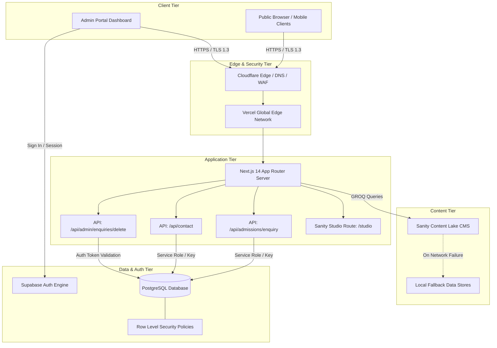
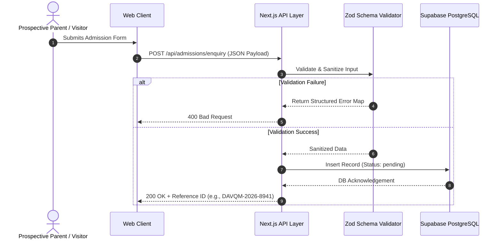

# DAV Public School, Qilla Mandi — Web Platform

## 1. Executive Overview

This repository houses the official web portal and administrative management platform for DAV Public School, Qilla Mandi (Batala, Punjab). The application is engineered as an enterprise-grade digital experience serving prospective students, parents, faculty, and administrative staff.

The system combines a server-rendered, SEO-optimized public portal with a secure administrative dashboard for admission lead ingestion, contact dispatching, and content management via a headless CMS architecture.

---

## 2. System Architecture & Component Design

The platform employs a decoupled modern web architecture utilizing Next.js 14 (App Router) as the compute engine, Supabase PostgreSQL for relational data persistence and authentication, and Sanity.io for structured headless content delivery.



---

## 3. Technology Stack

### Core Framework & Runtime
- **Runtime**: Node.js >= 18.17.0
- **Framework**: Next.js 14.2 (App Router, Server Components, Route Handlers)
- **Language**: TypeScript 5.x (Strict type validation throughout)

### User Interface & Design System
- **Styling**: Tailwind CSS 3.4 with custom institutional design tokens (Navy, Gold, Cream)
- **Component Primitives**: Lucide React Icons
- **Animation Engine**: Framer Motion 11.x (Micro-interactions, scroll triggers)
- **Effects**: Canvas Confetti (Admission submission celebration)

### Data Persistence & Backend Infrastructure
- **Relational Database**: Supabase PostgreSQL
- **Identity & Authentication**: Supabase GoTrue Auth
- **Data Validation**: Zod Schema Parsing & Sanitization
- **Headless CMS**: Sanity Studio v3 (`next-sanity`, `@sanity/client`)

---

## 4. Security Architecture & Governance

The platform adheres to zero-trust design principles to ensure institutional and parent data remains strictly confidential.



### Security Measures Implemented:
1. **Zero Credential Exposure**: No API secrets, service keys, or project identifiers exist in tracked source code. All connections resolve dynamically via `process.env`.
2. **HTTP Security Headers**: Configured in `next.config.mjs`:
   - `Strict-Transport-Security`: Enforces 2-year HTTPS preload across all subdomains.
   - `X-Frame-Options: SAMEORIGIN`: Mitigates clickjacking attacks.
   - `X-Content-Type-Options: nosniff`: Prevents MIME-type sniffing vulnerabilities.
   - `X-XSS-Protection: 1; mode=block`: Activates browser XSS filters.
   - `Referrer-Policy: origin-when-cross-origin`: Restricts referrer leakage.
   - `poweredByHeader: false`: Strips `X-Powered-By: Next.js` fingerprint header.
3. **Database Row Level Security (RLS)**: Public callers are restricted to write-only (`INSERT`) actions on enquiry tables. Read (`SELECT`), update (`UPDATE`), and delete (`DELETE`) permissions require an authenticated administrator session.

---

## 5. Database Schema & Architecture

The database runs on Supabase PostgreSQL. Database migrations are documented in `/supabase/migrations/`.

### Table: `admission_enquiries`
| Column Name | Data Type | Constraints | Description |
| :--- | :--- | :--- | :--- |
| `id` | `UUID` | Primary Key, Default `gen_random_uuid()` | Unique record identifier |
| `reference_id` | `VARCHAR(50)` | Nullable, Indexed | Unique tracking ID (e.g. DAVQM-2026-1024) |
| `student_name` | `VARCHAR(255)` | NOT NULL | Full name of student |
| `applying_for_class` | `VARCHAR(50)` | NOT NULL | Grade applied for (Nursery to Class 10) |
| `parent_name` | `VARCHAR(255)` | NOT NULL | Father/Mother/Guardian name |
| `phone` | `VARCHAR(20)` | NOT NULL | Primary contact phone number |
| `email` | `VARCHAR(255)` | Nullable | Email address for correspondence |
| `city_or_area` | `VARCHAR(255)` | Nullable | Residential locality / town |
| `academic_year` | `VARCHAR(20)` | Nullable | Target academic session (2026-2027) |
| `preferred_contact_method` | `VARCHAR(50)` | Default `'WhatsApp'` | Preferred communication channel |
| `message` | `TEXT` | Nullable | Additional notes or queries from parent |
| `status` | `VARCHAR(50)` | Default `'new'` | Lifecycle state: `pending`, `contacted`, `admitted`, `archived` |
| `source` | `VARCHAR(100)` | Default `'website_admission_form'` | Ingestion source tracking |
| `created_at` | `TIMESTAMPTZ` | Default `NOW()` | Timestamp of form submission |

### Table: `contact_enquiries`
| Column Name | Data Type | Constraints | Description |
| :--- | :--- | :--- | :--- |
| `id` | `UUID` | Primary Key, Default `gen_random_uuid()` | Unique message identifier |
| `name` | `VARCHAR(255)` | NOT NULL | Full name of sender |
| `phone` | `VARCHAR(20)` | Nullable | Sender telephone number |
| `email` | `VARCHAR(255)` | Nullable | Sender email address |
| `subject` | `VARCHAR(255)` | Nullable | Subject classification |
| `category` | `VARCHAR(100)` | Default `'General Enquiry'` | Message category |
| `message` | `TEXT` | NOT NULL | Message body |
| `status` | `VARCHAR(50)` | Default `'new'` | Lifecycle state: `pending`, `responded`, `archived` |
| `source` | `VARCHAR(100)` | Default `'website_contact_form'` | Source marker |
| `created_at` | `TIMESTAMPTZ` | Default `NOW()` | Timestamp of dispatch |

---

## 6. Headless CMS Content Schemas (Sanity Studio)

Content schemas are registered in `src/sanity/schemaTypes/index.ts` and managed via Sanity Studio (`/studio` or `https://<project-id>.sanity.studio`):

| Schema Type | Purpose | Primary Fields |
| :--- | :--- | :--- |
| `siteSettings` | Institutional Meta & Global Config | `schoolName`, `logo`, `favicon`, `phone`, `email`, `address`, `googleMapsUrl`, `socialLinks`, `officeHours` |
| `principalMessage` | Principal Desk Communique | `name`, `designation`, `photo`, `shortMessage`, `message`, `isPublished` |
| `news` | News, Circulars & Notices | `title`, `slug`, `category`, `excerpt`, `content`, `author`, `publishedAt`, `featuredImage`, `isFeatured` |
| `event` | Academic & Cultural Calendar | `title`, `slug`, `category`, `description`, `startDate`, `endDate`, `location`, `registrationUrl`, `featuredImage` |
| `achievement` | Board Results, Sports & Awards | `title`, `slug`, `category`, `year`, `date`, `studentName`, `class`, `description`, `featuredImage` |
| `galleryAlbum` | Campus & Event Photographic Archives | `title`, `slug`, `category`, `description`, `eventDate`, `coverImage`, `images[]` |
| `facility` | Campus Infrastructure Showcases | `name`, `slug`, `category`, `description`, `specifications[]`, `featuredImage`, `order` |
| `testimonial` | Parent & Alumni Feedback | `name`, `role`, `detail`, `quote`, `photo`, `isFeatured`, `order` |
| `faq` | Admissions & Institutional FAQs | `question`, `answer`, `category`, `order` |

---

## 7. Installation & Local Development

### Prerequisites
- Node.js version 18.17.0 or higher
- npm version 9.x or higher
- Git version control

### 1. Clone Repository
```bash
git clone https://github.com/sumit007-ui/DAV-School-Qila-Mandi.git
cd DAV-School-Qila-Mandi
```

### 2. Install Dependencies
```bash
npm install
```

### 3. Setup Environment Variables
Create a local `.env.local` file by copying the template:
```bash
cp .env.example .env.local
```

Populate `.env.local` with your credentials:
```env
# Sanity CMS Configuration
NEXT_PUBLIC_SANITY_PROJECT_ID=your-sanity-project-id
NEXT_PUBLIC_SANITY_DATASET=production
NEXT_PUBLIC_SANITY_API_VERSION=2024-08-31

# Supabase Database Configuration
NEXT_PUBLIC_SUPABASE_URL=https://your-project.supabase.co
NEXT_PUBLIC_SUPABASE_ANON_KEY=your-supabase-anon-key
NEXT_PUBLIC_SUPABASE_PUBLISHABLE_KEY=your-supabase-publishable-key
SUPABASE_SERVICE_ROLE_KEY=your-supabase-service-role-key

# Optional Notification Services
RESEND_API_KEY=
```

### 4. Execute Development Server
```bash
npm run dev
```
Access the application locally at `http://localhost:3000`.

### 5. Validate Production Build
```bash
npm run build
```

---

## 8. Deployment Manual

### Deployment to Vercel (Recommended)
1. Navigate to [Vercel Dashboard](https://vercel.com/new).
2. Select **Import Git Repository** and choose `sumit007-ui/DAV-School-Qila-Mandi`.
3. Verify Framework Preset is set to **Next.js**.
4. Configure **Environment Variables** in the Vercel project settings matching `.env.example`.
5. Click **Deploy**. Vercel will compile static routes and provision serverless execution automatically.

### Database Setup on Supabase
1. Create a project on [Supabase](https://supabase.com).
2. Open the **SQL Editor** in your Supabase dashboard.
3. Execute the SQL scripts in order:
   - `supabase/migrations/001_create_enquiries_tables.sql`
   - `supabase/migrations/002_admin_enquiries_policy.sql`
   - `supabase/migrations/003_admin_delete_policy.sql`
4. Create an Administrator account in Supabase Dashboard under **Authentication ➔ Users ➔ Add User**.

---

## 9. Administrative Operations Manual

### Admin Authentication
- Login URL: `/admin/login`
- Enter the email and password provisioned in Supabase Authentication.
- Upon successful authentication, the system securely redirects to `/admin/enquiries`.

### Managing Enquiries & Data Records
- **Tab Switching**: Toggle between *Admission Enquiries* and *Contact Inquiries*.
- **Search & Filtering**: Search in real-time by student name, parent name, telephone, reference ID, or class. Filter records by status (`pending`, `contacted`, `admitted`, `archived`).
- **Status Updating**: Modify status directly from the dropdown selector in any table row. Changes persist to Supabase immediately.
- **Detailed Dossier Inspection**: Click the Eye icon on any record to view comprehensive parental inquiries, timestamps, and address information.
- **Permanent Record Deletion**:
  1. Click the Trash icon on any table row or within the detail modal.
  2. A dedicated glassmorphic confirmation modal will appear with the record summary.
  3. Confirm deletion. The record will be permanently purged from Supabase, and the UI will update optimistically with a confirmation toast.
- **CSV Data Export**: Click **Export CSV** in the top navigation bar to generate an offline spreadsheet of filtered enquiry records.

---

## 10. Repository Directory Structure

```
DAV-School-Qila-Mandi/
├── src/
│   ├── app/
│   │   ├── about/                   # About School, History & Leadership
│   │   ├── academics/               # Curriculum & Academic Stages
│   │   ├── achievements/            # Board Results, Sports & Awards
│   │   ├── admin/
│   │   │   ├── enquiries/           # Administrative Enquiries Dashboard
│   │   │   └── login/               # Secure Admin Authentication
│   │   ├── admissions/              # Admission Procedure, Eligibility & Fees
│   │   ├── api/
│   │   │   ├── admin/enquiries/delete/ # Admin Deletion Route Handler
│   │   │   ├── admissions/enquiry/  # Admission Form Ingestion Handler
│   │   │   └── contact/             # Contact Form Dispatch Handler
│   │   ├── campus/                  # Infrastructure, Labs & Sports Complex
│   │   ├── contact/                 # Contact Information & Inquiry Form
│   │   ├── events/                  # School Events & Annual Calendar
│   │   ├── gallery/                 # Photographic Campus & Event Archives
│   │   ├── mandatory-disclosure/    # CBSE Mandatory Disclosures & Affiliation
│   │   ├── news/                    # Press Releases, Circulars & Bulletins
│   │   ├── privacy/                 # Privacy Policy
│   │   ├── student-life/            # Clubs, Houses & Extracurriculars
│   │   ├── studio/[[...tool]]/      # Embedded Sanity Studio CMS
│   │   ├── terms/                   # Terms & Conditions
│   │   ├── globals.css              # Global Typography & Token Definitions
│   │   ├── layout.tsx               # Root Layout & Metadata Setup
│   │   ├── not-found.tsx            # Custom 404 Error Experience
│   │   ├── page.tsx                 # Public Institutional Homepage
│   │   ├── robots.ts                # Dynamic Search Engine Robots Rules
│   │   └── sitemap.ts               # Dynamic XML Sitemap Generator
│   ├── components/                  # Modular Presentation & Interactive Components
│   ├── config/                      # Institutional Configuration Defaults
│   ├── lib/
│   │   ├── data/                    # Fallback Datasets (News, Events, Achievements)
│   │   ├── seo/                     # JSON-LD Structured Schema & Meta Generators
│   │   ├── supabase/                # Browser & Server Database Clients
│   │   └── validation/              # Zod Ingestion Schemas
│   ├── sanity/                      # CMS Client, Schema Types & GROQ Queries
│   └── types/                       # Shared TypeScript Type Declarations
├── supabase/
│   └── migrations/                  # SQL Table Definitions & RLS Policies
├── .env.example                     # Environment Template
├── .gitignore                       # Production Secret & Cache Exclusion Rules
├── next.config.mjs                  # Next.js Build Configuration & HTTP Headers
├── package.json                     # Dependency Manifest
├── sanity.cli.ts                    # Sanity CLI Configuration
├── sanity.config.ts                 # Sanity Studio Root Configuration
├── tailwind.config.ts               # Custom Color Tokens & Layout Utilities
└── tsconfig.json                    # TypeScript Strict Configuration
```

---

## 11. Quality Assurance & Verification

- **Type Verification**: `npm run build` runs `tsc --noEmit` and validates 100% strict type safety.
- **Static Route Generation**: 26 core application routes statically compiled and optimized.
- **Fault-Tolerant Data Layer**: All external API interactions implement resilient fallbacks ensuring zero runtime page crashes in offline or unconfigured CMS environments.

---

## 12. License & Intellectual Property

Copyright 2026 DAV Public School, Qilla Mandi (Batala, Punjab). All rights reserved.
Developed for institutional operations under the guidance of DAV College Managing Committee (DAVCMC), New Delhi.
