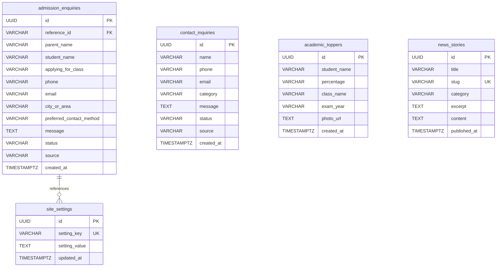
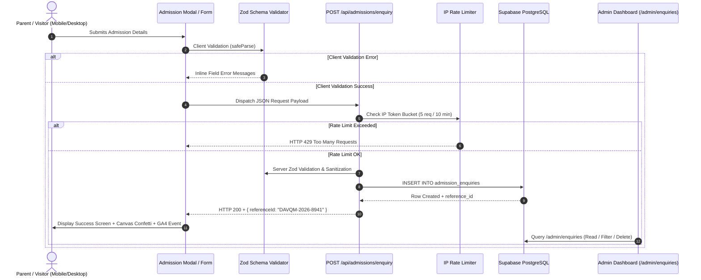

# System Design Document (SDD) & Enterprise Specification
## Dr. MRS Bhalla DAV Public School — Digital Platform & Administrative Management Suite

> **Document Version:** 2.0.0 (Production Ready)  
> **System Classification:** Institutional Enterprise Web Platform & Lead Intelligence Suite  
> **Engineering Partner:** [DEVNXY™](https://devnxy.in/) — High-Performance Web & App Development Agency  
> **Managing Authority:** DAV College Managing Committee (DAVCMC), New Delhi  
> **Institutional Branch:** Dr. MRS Bhalla DAV Public School, Qila Mandi, Batala, Punjab  

---

## 1. Executive Summary & System Objectives

This System Design Document (SDD) outlines the end-to-end technical architecture, component design, database schemas, API contracts, security models, mobile viewport specs, and deployment protocols for the official web application and administrative management system of **Dr. MRS Bhalla DAV Public School, Qila Mandi, Batala**.

### Primary System Objectives:
1. **High-Performance Public Portal:** Deliver a server-rendered, SEO-optimized digital experience across Desktop and Mobile browsers (iOS Safari & Android Chrome).
2. **Zero-Data-Loss Admission Ingestion:** Provide an immediate lead registration pipeline (`/api/admissions/enquiry`) with rate-limiting, validation, and automated reference tracking (`DAVQM-2026-XXXX`).
3. **Administrative Lead & Content Suite:** Provide a secure administrative dashboard (`/admin`) for lead management, CSV exports, site settings overrides, photo bucket management, and news circular publishing.
4. **Mobile UX & Safe-Area Compliance:** Guarantee pixel-perfect rendering across notched iPhones (Dynamic Island) and Android smartphones with dynamic viewport height (`100dvh`) and 44px+ touch targets.

---

## 2. High-Level Architecture (HLD)

The platform is built on a 4-tier decoupled web architecture leveraging **Next.js 14 App Router** for compute and rendering, **Supabase PostgreSQL** for relational persistence and storage, and **Sanity.io** for headless content management.

```mermaid
graph TD
    subgraph Tier 1: Client & Presentation Tier
        MobileSafari[iOS Safari Clients / Notched iPhones]
        MobileChrome[Android Chrome / Touch Viewports]
        DesktopBrowsers[Desktop Clients / Chrome, Safari, Firefox, Edge]
        AdminDashboard[Administrative Suite /admin]
    end

    subgraph Tier 2: Edge & Security Gateway
        EdgeWAF[Cloudflare DNS / Edge Network]
        VercelCDN[Vercel Global Edge Serverless Engine]
        RateLimiter[IP Rate Limiter - Token Bucket 5 req/10m]
        ZodValidator[Zod Payload Validator & XSS Sanitizer]
    end

    subgraph Tier 3: Compute & API Layer
        NextAppRouter[Next.js 14 App Router Server Components]
        API_Admissions[API: POST /api/admissions/enquiry]
        API_Contact[API: POST /api/contact]
        API_Settings[API: GET/POST /api/settings & /api/admin/settings]
        API_AdminEnquiries[API: GET/DELETE /api/admin/enquiries]
        API_Photos[API: POST /api/admin/photos]
        StudioCMS[Sanity Studio Route /studio]
    end

    subgraph Tier 4: Persistence, Storage & Auth Tier
        SupabaseAuth[Supabase GoTrue JWT Auth]
        SupabaseDB[(Supabase PostgreSQL Relational DB)]
        SupabaseStorage[Supabase Storage Buckets - Campus Assets]
        SanityLake[Sanity Content Lake CMS]
    end

    MobileSafari -->|HTTPS TLS 1.3| EdgeWAF
    MobileChrome -->|HTTPS TLS 1.3| EdgeWAF
    DesktopBrowsers -->|HTTPS TLS 1.3| EdgeWAF
    AdminDashboard -->|HTTPS TLS 1.3| EdgeWAF

    EdgeWAF --> VercelCDN
    VercelCDN --> NextAppRouter

    NextAppRouter --> RateLimiter
    RateLimiter --> ZodValidator
    ZodValidator --> API_Admissions
    ZodValidator --> API_Contact
    NextAppRouter --> API_Settings
    NextAppRouter --> API_AdminEnquiries
    NextAppRouter --> API_Photos
    NextAppRouter --> StudioCMS

    API_Admissions -->|Service Role Key| SupabaseDB
    API_Contact -->|Service Role Key| SupabaseDB
    API_AdminEnquiries -->|Auth Session Cookie| SupabaseDB
    API_Photos -->|Storage Bucket API| SupabaseStorage
    AdminDashboard -->|HTTP-only Session| SupabaseAuth
    NextAppRouter -.->|GROQ Headless Queries| SanityLake
```

---

## 3. Low-Level Component Design (LLD)

### 3.1 Component Hierarchy & Layering

```
RootLayout (src/app/layout.tsx)
 ├── AnalyticsProvider (GA4 Event Tracker)
 ├── ScrollProgress (Motion Bar)
 ├── ClientAppWrapper (Context Provider & Modal Orchestrator)
 │    ├── Navbar (Fixed Header z-[70] + Fullscreen Mobile Overlay z-[60])
 │    ├── Main Content Page Node (flex-1)
 │    ├── Footer (Institutional Sitemap & DEVNXY Attribution)
 │    ├── MobileFloatingBar (Fixed Bottom Bar z-50, sm:hidden)
 │    ├── WhatsAppFloatingButton (FAB z-30, Expandable Chat Card)
 │    ├── SearchModal (Global Search z-50, Cmd+K Trigger)
 │    └── AdmissionModal (Enquiry Modal z-50, Confetti Feedback)
```

### 3.2 Mobile Viewport & Touch Engine
- **Dynamic Viewport Height (`100dvh`)**: Prevents layout clipping when mobile browser address bars auto-expand/collapse.
- **Safe Area Inset Handling**: Padding configured via `env(safe-area-inset-top)` and `env(safe-area-inset-bottom)` for notched iPhones and Dynamic Island.
- **Dual Scroll Locking**: Sets `overflow: hidden` on both `document.documentElement` and `document.body` along with `overscroll-behavior: contain` to prevent background bleed on iOS Safari.
- **Touch Targets**: Enforces 44px–50px minimum hit areas with `-webkit-tap-highlight-color: transparent` and `touch-action: manipulation`.

---

## 4. Database Schema Specification (Supabase PostgreSQL)


```mermaid
erDiagram
    admission_enquiries {
        UUID id PK
        VARCHAR reference_id FK
        VARCHAR parent_name
        VARCHAR student_name
        VARCHAR applying_for_class
        VARCHAR phone
        VARCHAR email
        VARCHAR city_or_area
        VARCHAR preferred_contact_method
        TEXT message
        VARCHAR status
        VARCHAR source
        TIMESTAMPTZ created_at
    }

    contact_inquiries {
        UUID id PK
        VARCHAR name
        VARCHAR phone
        VARCHAR email
        VARCHAR category
        TEXT message
        VARCHAR status
        VARCHAR source
        TIMESTAMPTZ created_at
    }

    site_settings {
        UUID id PK
        VARCHAR setting_key UK
        TEXT setting_value
        TIMESTAMPTZ updated_at
    }

    academic_toppers {
        UUID id PK
        VARCHAR student_name
        VARCHAR percentage
        VARCHAR class_name
        VARCHAR exam_year
        TEXT photo_url
        TIMESTAMPTZ created_at
    }

    news_stories {
        UUID id PK
        VARCHAR title
        VARCHAR slug UK
        VARCHAR category
        TEXT excerpt
        TEXT content
        TIMESTAMPTZ published_at
    }

    admission_enquiries ||--o{ site_settings : references
```

### Table Definitions & Constraints

#### 1. `admission_enquiries`
```sql
CREATE TABLE public.admission_enquiries (
  id UUID PRIMARY KEY DEFAULT gen_random_uuid(),
  reference_id VARCHAR(50) UNIQUE DEFAULT ('DAVQM-' || extract(year from now()) || '-' || floor(random() * 9000 + 1000)::text),
  parent_name VARCHAR(255) NOT NULL,
  student_name VARCHAR(255) NOT NULL,
  applying_for_class VARCHAR(50) NOT NULL,
  phone VARCHAR(20) NOT NULL,
  email VARCHAR(255),
  city_or_area VARCHAR(255),
  preferred_contact_method VARCHAR(50) DEFAULT 'WhatsApp',
  message TEXT,
  status VARCHAR(50) DEFAULT 'new',
  source VARCHAR(100) DEFAULT 'website_admission_form',
  created_at TIMESTAMPTZ DEFAULT NOW()
);

-- Indexing for fast search and admin lookup
CREATE INDEX idx_admission_reference ON public.admission_enquiries (reference_id);
CREATE INDEX idx_admission_status ON public.admission_enquiries (status);
```

#### 2. `contact_inquiries`
```sql
CREATE TABLE public.contact_inquiries (
  id UUID PRIMARY KEY DEFAULT gen_random_uuid(),
  name VARCHAR(255) NOT NULL,
  phone VARCHAR(20),
  email VARCHAR(255),
  category VARCHAR(100) DEFAULT 'General Enquiry',
  message TEXT NOT NULL,
  status VARCHAR(50) DEFAULT 'new',
  source VARCHAR(100) DEFAULT 'website_contact_form',
  created_at TIMESTAMPTZ DEFAULT NOW()
);

CREATE INDEX idx_contact_status ON public.contact_inquiries (status);
```

---

## 5. End-to-End Data Flow Sequence


```mermaid
sequenceDiagram
    autonumber
    actor User as Parent / Visitor (Mobile/Desktop)
    participant Modal as Admission Modal / Form
    participant Zod as Zod Schema Validator
    participant API as POST /api/admissions/enquiry
    participant RateLimit as IP Rate Limiter
    participant DB as Supabase PostgreSQL
    participant Admin as Admin Dashboard (/admin/enquiries)

    User->>Modal: Submits Admission Details
    Modal->>Zod: Client Validation (safeParse)
    alt Client Validation Error
        Zod-->>Modal: Inline Field Error Messages
    else Client Validation Success
        Modal->>API: Dispatch JSON Request Payload
        API->>RateLimit: Check IP Token Bucket (5 req / 10 min)
        alt Rate Limit Exceeded
            RateLimit-->>Modal: HTTP 429 Too Many Requests
        else Rate Limit OK
            API->>Zod: Server Zod Validation & Sanitization
            API->>DB: INSERT INTO admission_enquiries
            DB-->>API: Row Created + reference_id
            API-->>Modal: HTTP 200 + { referenceId: "DAVQM-2026-8941" }
            Modal->>User: Display Success Screen + Canvas Confetti + GA4 Event
            Admin->>DB: Query /admin/enquiries (Read / Filter / Delete)
        end
    end
```

---

## 6. Technology Stack Specification

| Tier / Subsystem | Technology | Specification / Purpose |
| :--- | :--- | :--- |
| **Compute Framework** | Next.js 14.2 (App Router) | Server Components, Route Handlers, Prerendering |
| **Runtime Language** | TypeScript 5.x | Strict Type Safety across 100% of repository |
| **Design System** | Tailwind CSS 3.4 + Vanilla CSS | Custom Institutional Color Palette & 4-Font Typography |
| **Typography System** | Google Fonts | `Cormorant Garamond`, `Manrope`, `DM Mono`, `Playfair Display` |
| **Database** | Supabase PostgreSQL | Relational storage, indexing, RLS security |
| **Storage Buckets** | Supabase Storage | Campus & Gallery image asset management |
| **Authentication** | Supabase Auth (GoTrue) | Encrypted HTTP-only admin session cookies |
| **Validation & Security**| Zod + XSS Sanitizer | Schema parsing & HTML entity escaping |
| **Rate Limiter** | Token Bucket Algorithm | IP-based request limiting on public APIs |
| **Analytics Engine** | GA4 / Firebase Analytics | Event tracking for CTA clicks & lead funnels |

---

## 7. Directory & Module Architecture

```
DAV-School-Qila-Mandi/
├── src/
│   ├── app/
│   │   ├── about/                   # About School, History & Leadership
│   │   ├── academics/               # Curriculum & Academic Stages
│   │   ├── achievements/            # Board Results, Sports & Awards
│   │   ├── admin/
│   │   │   ├── enquiries/           # Lead Intelligence & Dashboard
│   │   │   └── login/               # Secure Admin Authentication
│   │   ├── admissions/              # Admission Procedure & Fee Structure
│   │   ├── api/
│   │   │   ├── admin/enquiries/     # Admin Lead Management API
│   │   │   ├── admissions/enquiry/  # Admission Form Ingestion API
│   │   │   ├── contact/             # Contact Helpdesk Ingestion API
│   │   │   ├── news/                # News & Circulars API
│   │   │   ├── photos/              # Campus Photos API
│   │   │   └── settings/            # Site Overrides API
│   │   ├── campus/                  # Infrastructure, Computer & Science Labs
│   │   ├── contact/                 # Helpdesk Form & Campus Location
│   │   ├── gallery/                 # Photographic Campus Archives
│   │   ├── mandatory-disclosure/    # PSEB Board Mandatory Disclosures
│   │   ├── news/                    # Bulletins, Circulars & Events
│   │   ├── student-life/            # House System, Athletics & Clubs
│   │   ├── studio/[[...tool]]/      # Embedded Sanity Studio CMS
│   │   ├── globals.css              # Typography & CSS Variable Definitions
│   │   ├── layout.tsx               # Root Layout & Metadata
│   │   └── page.tsx                 # Public Institutional Homepage
│   ├── components/
│   │   ├── forms/                   # Admission & Contact Forms
│   │   ├── layout/                  # Client Wrapper & Providers
│   │   ├── navigation/              # Navbar, Footer, MobileFloatingBar
│   │   ├── sections/                # Institutional Homepage Sections
│   │   └── ui/                      # WhatsApp FAB, Search Modal, Brand Logo
│   ├── config/                      # Institutional Configuration Defaults
│   └── lib/
│       ├── data/                    # Fallback Data Stores
│       ├── security/                # Rate Limiter & XSS Sanitizer
│       ├── supabase/                # Server & Browser DB Clients
│       └── validation/              # Zod Ingestion Schemas
├── supabase/
│   └── migrations/                  # SQL Schema Definitions & Indexes
├── README.md                        # System Design Document (SDD)
└── next.config.mjs                  # Build Config & Security Headers
```

---

## 8. Development & Production Operations

### 1. Installation & Environment Setup
```bash
git clone https://github.com/sumit007-ui/DAV-School-Qila-Mandi.git
cd DAV-School-Qila-Mandi
npm install
```

### 2. Configure Environment Variables (`.env.local`)
```env
NEXT_PUBLIC_SUPABASE_URL=https://your-project.supabase.co
NEXT_PUBLIC_SUPABASE_ANON_KEY=your-supabase-anon-key
SUPABASE_SERVICE_ROLE_KEY=your-supabase-service-role-key
```

### 3. Local Execution & Build Verification
```bash
# Start local dev server
npm run dev

# Compile production build (Verifies all 35 static routes)
npm run build
```

---

## 9. Development & Agency Attribution

Engineered, Designed & Optimized by **DEVNXY™**  
*High-Performance Web & App Development Agency*  
Website: [https://devnxy.in/](https://devnxy.in/)

---

## 10. License & Copyright

Copyright © 2026 Dr. MRS Bhalla DAV Public School, Qila Mandi (Batala, Punjab). All rights reserved.  
Managed by DAV College Managing Committee (DAVCMC), New Delhi.
