# DAV Public School, Qilla Mandi — UI/UX Knowledge Base & Redesign Requirements Specification

---

## 1. Executive Summary & Brand Identity

### 1.1 Institution Profile
* **Institution Name**: DAV Public School, Qilla Mandi, Batala
* **Parent Organization**: DAV College Managing Committee (DAVCMC), New Delhi
* **Affiliation**: Central Board of Secondary Education (CBSE), New Delhi (Affiliation No: `1630182`, School Code: `20176`)
* **Established**: 1989 (35+ Years of Academic Excellence)
* **Grades Offered**: Early Years (Pre-Nursery, Nursery, LKG, UKG) to Class 10 (Secondary)
* **Motto**: *"Work is Worship • तमसो मा ज्योतिर्गमय"* (From darkness, lead me to light)
* **Tagline**: *"Where Curiosity Begins. Growing Minds, Building Futures."*
* **Location**: Qilla Mandi Road, Near Historic Qilla Mandi, Batala, District Gurdaspur, Punjab — 143505

### 1.2 Purpose of this Document
This document is the **authoritative UI/UX Design System, Content Hierarchy, and Redesign Specification** for the modern web platform of DAV Public School, Qilla Mandi. It defines the visual identity, typography system, color tokens, layout ergonomics, page teardowns, data structures, and actionable redesign requirements.

---

## 2. Refined Visual Identity & Design System

### 2.1 Aesthetic Archetype: *Sophisticated Academic Calm*
* **Benchmark & Inspiration**: Modern British boarding schools and prestigious academic institutions (e.g., *Winchester College*).
* **Atmosphere**: Calm, prestigious, intellectual, and timeless. Moving away from loud/gold-heavy styles to a serene, high-end palette of deep navy, muted teal, soft sage, and warm ivory.

---

### 2.2 Color Palette & Token System

```
┌───────────────────────────────────────────────────────────────────────────────┐
│                      REFINED VISUAL COLOR SYSTEM                              │
├───────────────────────────────────────────────────────────────────────────────┤
│  PRIMARY DEEP NAVY: #16324F                                                  │
│  ├── Role: Brand Authority, Primary Headers, Dark Surfaces, Hero Accents      │
│  └── Usage: Navigation bar, primary button fills, institutional badges        │
│                                                                               │
│  SECONDARY MUTED TEAL: #527A78                                                │
│  ├── Role: Academic Sophistication, Section Accents, Secondary Badges        │
│  └── Usage: Category pills, subtle borders, sub-headings, interactive states  │
│                                                                               │
│  ACCENT SOFT SAGE: #A8C3BC                                                    │
│  ├── Role: Highlights, Focus Rings, Light Tag Backgrounds                     │
│  └── Usage: Hover state glows, pill backgrounds, decorative borders           │
│                                                                               │
│  BACKGROUND WARM IVORY: #F5F3EE                                               │
│  ├── Role: Main Canvas & Page Background                                      │
│  └── Usage: Whole-page canvas, soothing off-white readability surface         │
│                                                                               │
│  SURFACE CLEAN WHITE: #FFFFFF                                                 │
│  ├── Role: Card Backgrounds, Content Blocks, Modals                           │
│  └── Usage: Bento grid cards, modal dialogues, input fields, dropdowns        │
│                                                                               │
│  BODY TEXT DARK SLATE: #1C2730                                                │
│  ├── Role: High-Legibility Primary Text                                       │
│  └── Usage: Body paragraphs, descriptions, form labels, data table cells      │
│                                                                               │
│  MUTED SLATE / GRAY: #6B7478                                                  │
│  ├── Role: Captions, Timestamps, Secondary Meta                               │
│  └── Usage: Dates, breadcrumbs, placeholder text, footnotes                   │
└───────────────────────────────────────────────────────────────────────────────┘
```

#### Color Mapping Token Table:
| Token Name | Hex Code | Purpose / UI Placement |
| :--- | :--- | :--- |
| `primary` | `#16324F` | Main brand color, navbar background, hero headings, major CTAs |
| `secondary` | `#527A78` | Sub-headers, secondary buttons, academic stage badges, icons |
| `accent` | `#A8C3BC` | Subtle highlights, active filter tabs, delicate divider lines |
| `background` | `#F5F3EE` | Warm ivory canvas (reduces screen glare, feels like high-grade paper) |
| `surface` | `#FFFFFF` | Card surfaces, container modules, modal windows, form inputs |
| `text` | `#1C2730` | Core reading copy (ultra-high contrast without harsh pure black) |
| `muted` | `#6B7478` | Metadata, captions, school affiliation numbers, breadcrumbs |

---

### 2.3 Typography System

The design uses a **refined editorial serif for prestige headings** paired with a **clean, contemporary geometric sans-serif for body, UI, buttons, and navigation**.

```
┌───────────────────────────────────────────────────────────────────────────────┐
│                           TYPOGRAPHY PAIRING                                  │
├───────────────────────────────────────────────────────────────────────────────┤
│  HEADINGS: Playfair Display (Google Fonts)                                    │
│  ├── Weight: 500 (Medium) / 600 (Semi-Bold)                                   │
│  ├── Character: Elegant, timeless, academic, editorial authority              │
│  └── Scope: H1 Hero titles, H2 section headers, prestige pull quotes         │
│                                                                               │
│  BODY & UI: Manrope (Google Fonts)                                            │
│  ├── Weight: 400 (Regular) / 500 (Medium) / 600 (Semi-Bold)                   │
│  ├── Character: Modern, clean, geometric, exceptionally legible on screens     │
│  └── Scope: Body text, lead paragraphs, buttons, navigation, forms, badges    │
└───────────────────────────────────────────────────────────────────────────────┘
```

#### Typography Scale & Specifications:

| Level / Component | Font Family | Size Range | Weight | Line Height | Letter Spacing |
| :--- | :--- | :--- | :--- | :--- | :--- |
| **Hero H1** | `Playfair Display` | `64px – 76px` (`text-5xl lg:text-7xl`) | `600` | `1.05` | `-0.03em` |
| **Section H2** | `Playfair Display` | `42px – 52px` (`text-3xl lg:text-5xl`) | `600` | `1.10` | `-0.02em` |
| **Sub-header H3** | `Playfair Display` | `28px – 34px` (`text-2xl lg:text-3xl`) | `500` | `1.20` | `-0.01em` |
| **Lead Subheading**| `Manrope` | `18px – 22px` (`text-lg lg:text-xl`) | `500` | `1.50` | `normal` |
| **Body Paragraphs**| `Manrope` | `16px – 18px` (`text-base lg:text-lg`)| `400` | `1.70` | `normal` |
| **Small Text / Meta**| `Manrope` | `13px – 14px` (`text-xs sm:text-sm`) | `500` | `1.40` | `+0.02em` |
| **Navigation Links**| `Manrope` | `14px – 15px` (`text-sm font-semibold`)| `600` | `1.00` | `+0.01em` |
| **Buttons & CTAs** | `Manrope` | `14px – 15px` (`text-sm uppercase/caps`)| `600` | `1.00` | `+0.03em` |
| **Badges & Tags** | `Manrope` | `12px – 13px` (`text-xs font-semibold`)| `600` | `1.00` | `+0.04em` |

#### Typography Application Rule (Strict):
* **Do NOT use Playfair Display for general UI, buttons, or paragraph text.**
* **Example Usage**:
  - `Playfair Display`: *"Where Excellence Meets Opportunity"* / *"35 Years of Academic Stature"*
  - `Manrope`: *"Empowering students with knowledge, character and confidence from Nursery to Class 10."*
  - `Manrope (Semibold)`: `EXPLORE OUR SCHOOL` / `APPLY FOR ADMISSION` / `ACADEMIC CALENDAR`

#### Optional Minimalist Modern Alternative:
* If a strictly non-serif, tech-forward, minimal look is desired:
  - **Headings**: `DM Sans` (`600–700`)
  - **Body & UI**: `Manrope` (`400–500`)

---

## 3. Information Architecture & Route Matrix

```mermaid
graph TD
    Home["/ (Institutional Homepage)"]
    
    About["/about (About School & Leadership)"]
    Academics["/academics (Curriculum & Stages)"]
    Campus["/campus (Infrastructure & 360 Labs)"]
    StudentLife["/student-life (Clubs, Houses & Sports)"]
    Achievements["/achievements (Board Results & Honors)"]
    Admissions["/admissions (Admissions 2026-27 & Fees)"]
    News["/news (Circulars & School Press)"]
    Events["/events (Annual Academic Calendar)"]
    Gallery["/gallery (Campus Media Archives)"]
    Contact["/contact (Campus Map & Inquiries)"]
    Disclosure["/mandatory-disclosure (CBSE Compliance)"]
    Privacy["/privacy (Privacy Policy)"]
    Terms["/terms (Terms & Conditions)"]
    
    AdminLogin["/admin/login (Supabase Auth)"]
    AdminEnquiries["/admin/enquiries (Leads CRM Dashboard)"]
    SanityStudio["/studio (Headless CMS Management)"]

    Home --> About
    Home --> Academics
    Home --> Campus
    Home --> StudentLife
    Home --> Achievements
    Home --> Admissions
    Home --> News
    Home --> Events
    Home --> Gallery
    Home --> Contact
    Home --> Disclosure
    Home --> Privacy
    Home --> Terms
    
    AdminLogin --> AdminEnquiries
```



---

## 4. Page-by-Page Detailed Architecture & Content Teardown

### 4.1 Homepage (`/`)
* **Page Purpose**: Flagship landing page establishing institutional prestige, academic rigor, and seamless admission conversions.
* **Section Anatomy**:
  1. **Top Utility Bar**: Displays CBSE Affiliation (`No: 1630182`), helpline numbers, WhatsApp hotline, and office hours.
  2. **Floating Prestige Navbar**: Brand crest, navigation links, quick search (`Ctrl+K`), and `Apply Now` CTA.
  3. **Cinematic Hero Section**:
     - *Hero Title (Playfair Display)*: *"Where Curiosity Begins, Leaders Emerge."*
     - *Sub-headline (Manrope)*: *"Affiliated to CBSE New Delhi. Delivering 35+ years of academic excellence from Nursery to Class 10 in Batala, Punjab."*
     - *CTA Group*: Primary Button (`Apply for Session 2026-27` - `#16324F`), Secondary Button (`Download Prospectus` - White with `#16324F` border), Tertiary Link (`Explore Curriculum` ➔ `/academics`).
     - *Floating Badges*: CBSE Affiliated | 100% Pass Rate | 1:22 Teacher-to-Student Ratio.
  4. **Editorial Manifesto ("More Than A Classroom")**:
     - Pull-quote on child-centric holistic education blending Vedic ethics with STEM discoveries.
  5. **Verified Statistics Matrix**:
     - `35+` Years Legacy | `2,400+` Scholars | `100%` Board Results | `100+` Master Teachers | `12+` Acre Campus | `50+` State Accolades.
  6. **Principal's Perspective**:
     - Portrait, credentials (*Mrs. Paramjit Kaur, M.Sc., M.Ed., M.Phil.*), personal letter to parents, and institutional philosophy.
  7. **Interactive Learning Journey (4 Stages)**:
     - *Early Years (Nursery - UKG)* ➔ *Primary School (Classes 1-5)* ➔ *Middle School (Classes 6-8)* ➔ *Secondary Wing (Classes 9-10)*.
  8. **Why DAV (Bento Grid of Value Pillars)**:
     - Vedic Values, Experiential Science Labs, Smart Classrooms, Holistic Sports, Safety & Transport, 1:22 Mentorship.
  9. **Immersive Campus Showcase**:
     - Visual grid of Physics/Chem/Bio labs, Digital Library, Robotics Hub, and Sports Complex.
  10. **Student Life & House System**:
      - 4 Houses (*Dayanand, Hansraj, Shraddhanand, Virjanand*), clubs, and cultural activities.
  11. **Academic Laurels & Achievements**:
      - Class 10 board toppers, state Olympiad medalists, sports trophies.
  12. **Admissions Conversion Callout**:
      - 4-step clear process: Form ➔ Campus Interaction ➔ Verification ➔ Enrollment.
  13. **Live News, Circulars & Upcoming Events**:
      - Tabbed cards for notices, exams, holidays, and celebrations.
  14. **Curated Photo Gallery Preview**:
      - Masonry preview with instant lightbox viewer.
  15. **Parent & Alumni Testimonials**:
      - Verified feedback praising academic outcomes, safety, and values.
  16. **Grand Final CTA Banner**:
      - Deep Navy background (`#16324F`), Sage accent highlights, dual action triggers.

---

### 4.2 About Us (`/about`)
* **Page Purpose**: Chronicles the 35+ year heritage, DAV movement history, Vedic foundation, and leadership.
* **Key Components**:
  - **Hero Banner**: Founding story since 1989 in historic Batala.
  - **The DAV Movement Philosophy**: Synthesis of Vedic wisdom (*Arya Samaj*) and modern scientific learning.
  - **Managing Committee (DAVCMC New Delhi)**: Connection to India’s largest non-governmental educational network.
  - **Vision & Mission**: Clear structured commitments.
  - **Leadership Profiles**: School Manager (*Dr. V.K. Sharma*) & Principal (*Mrs. Paramjit Kaur*).
  - **Milestone Timeline**: 1989 Inception ➔ CBSE Affiliation ➔ Smart Campus Expansion ➔ STEM & Robotics Labs.

---

### 4.3 Academics (`/academics`)
* **Page Purpose**: Curriculum details, pedagogical methodology, subjects, and NEP 2020 alignment.
* **Key Components**:
  - **4-Stage Academic Structure**:
    1. *Early Years (Pre-Nursery to UKG)*: Sensory learning, phonics, gross motor skills.
    2. *Primary Wing (Classes 1 to 5)*: Core language, mental math, EVS, digital literacy.
    3. *Middle Wing (Classes 6 to 8)*: Dedicated science labs, coding, regional languages, Sanskrit, debates.
    4. *Secondary Wing (Classes 9 & 10)*: Rigorous CBSE board syllabus, career counseling, remedial mentoring.
  - **Continuous Comprehensive Evaluation (CCE)**: Assessment guidelines, term schedules, PTM cycles.
  - **Faculty Mentorship**: Teacher qualifications, student-teacher ratio (1:22), and ongoing educator training.

---

### 4.4 Campus & Infrastructure (`/campus`)
* **Page Purpose**: Visual and descriptive tour of physical facilities, safety, and transport.
* **Key Components**:
  - **Categorized Facility Showcase**:
    - *Smart Classrooms*: Interactive boards, climate comfort, ergonomic furniture.
    - *Science Laboratories*: Fully equipped physics, chemistry, and biology workstations.
    - *Computer & Robotics Lab*: High-speed network, coding software, hands-on robotics kits.
    - *Library & Reading Sanctuary*: 15,000+ titles, journals, digital repository.
    - *Sports Complex*: Basketball court, football grounds, cricket nets, badminton, skating rink.
    - *Safety & Transportation*: 24/7 CCTV surveillance, boundary security, GPS-tracked bus fleet.

---

### 4.5 Student Life & Culture (`/student-life`)
* **Page Purpose**: Extracurricular activities, co-curricular clubs, personality development, and house competitions.
* **Key Components**:
  - **House System**: 4 Houses competing in academics, sports, and cultural festivals.
  - **Activity Clubs**: STEM & Robotics, Eco-Warriors, Literary & Debates, Heritage & Arts, Music & Dance.
  - **Community Service**: Social drives, tree planting, charity initiatives.

---

### 4.6 Achievements & Board Laurels (`/achievements`)
* **Page Purpose**: Verifiable proof of student success in board exams, sports tournaments, and Olympiads.
* **Key Components**:
  - **Key Metrics**: 100% CBSE Class 10 Pass Rate, District First Ranks, 50+ State Medals.
  - **Yearly Filterable Archive**: Search and filter by Year (2025, 2024, 2023) and Category (Academics, Sports, Arts).
  - **Topper Wall of Fame**: Student photos, scores, and future career pathways.

---

### 4.7 Admissions Portal (`/admissions`)
* **Page Purpose**: High-conversion admission engine for new parent applications.
* **Key Components**:
  - **Admission Session 2026-27 Notice**: Open seats for Nursery to Class 10.
  - **4-Step Admission Procedure Walkthrough**:
    1. Online Enquiry / Registration.
    2. Campus Interaction & Diagnostic Assessment.
    3. Document Verification & Provisional Admission.
    4. Fee Payment & Class Induction.
  - **Age Eligibility Matrix**: Clear age chart for all grades.
  - **Document Checklist**: Birth certificate, Transfer Certificate (TC), Aadhaar, previous marksheet, photos.
  - **Fee Policy Overview**: Transparent fee structure, installments, and payment methods.
  - **Interactive Admission Form**: Direct on-page lead capture with instant WhatsApp confirmation.
  - **Admission FAQs**: Categorized accordion answering parent queries.

---

### 4.8 News, Circulars & Announcements (`/news`)
* **Page Purpose**: Real-time institutional circulars, press releases, and holiday notices.
* **Key Components**:
  - **Filter Tabs**: *All, Academic Circulars, Holiday Notices, Events, Press Releases*.
  - **Search Bar**: Instant keyword lookup.
  - **Circular Cards**: Date, category pill, excerpt, PDF download button.

---

### 4.9 Events & Academic Calendar (`/events`)
* **Page Purpose**: Chronological schedule of school activities, parent meetings, and sports meets.
* **Key Components**:
  - **Calendar / List View**: Monthly toggleable schedule.
  - **Event Cards**: Date range, location, audience, RSVP link.

---

### 4.10 Photo & Video Gallery (`/gallery`)
* **Page Purpose**: Curated visual record of campus life and functions.
* **Key Components**:
  - **Category Tabs**: *All, Infrastructure, Annual Function, Sports Day, Exhibitions, Hawan & Festivals*.
  - **Masonry Grid & Lightbox**: Full-screen preview with keyboard navigation.

---

### 4.11 Contact Us & Campus Visit (`/contact`)
* **Page Purpose**: Location guide, transport routes, helplines, and general contact form.
* **Key Components**:
  - **Contact Information Cards**:
    - Reception: `+91 1871 240567`
    - Admissions Helpline: `+91 98765 43210`
    - Official Email: `davqm_batala@yahoo.co.in`
    - Office Hours: Mon – Sat: 8:00 AM – 3:30 PM
  - **Interactive Contact Form**: Category selector, inquiry submission.
  - **Google Maps Integration**: Direct route navigation to Qilla Mandi campus.

---

### 4.12 CBSE Mandatory Public Disclosure (`/mandatory-disclosure`)
* **Page Purpose**: Mandatory statutory disclosure under CBSE affiliation bylaws.
* **Key Components**:
  - School Affiliation Number (`1630182`), School Code (`20176`).
  - Document Downloads: Affiliation Letter, Trust Certificate, NOC, Building Safety Certificate, Fire Safety Certificate, Water & Sanitation Certificate.
  - Academic fee schedule, SMC list, PTA members, past 3-year board exam statistics.
  - Teaching staff strength and infrastructure dimensions table.

---

### 4.13 Administrative Dashboard (`/admin/login` & `/admin/enquiries`)
* **Page Purpose**: Secure administrative CRM for managing student admission inquiries.
* **Key Features**:
  - Secure authentication via Supabase Auth.
  - Real-time search, filter by status (`pending`, `contacted`, `admitted`, `archived`) and grade.
  - One-click status updates, dossier inspector modal, WhatsApp concierge launcher, and CSV export.

---

## 5. Global Interactive Components & Overlays

```
┌───────────────────────────────────────────────────────────────────────────────┐
│                       GLOBAL INTERACTIVE COMPONENTS                           │
├───────────────────────────────────────────────────────────────────────────────┤
│ 1. STICKY PRESTIGE NAVBAR                                                     │
│    • Color: #16324F (Deep Navy) with subtle backdrop blur                     │
│    • Actions: Brand Logo, Nav Links, Ctrl+K Search Trigger, "Apply Now" CTA  │
│                                                                               │
│ 2. MOBILE BOTTOM FLOATING ACTION BAR                                          │
│    • Display: Fixed at bottom for screens < 640px                             │
│    • Buttons: [Call Helpline] | [WhatsApp Chat] | [Apply Online (Modal)]      │
│                                                                               │
│ 3. ADMISSION INTAKE MODAL                                                     │
│    • Trigger: Any "Apply Now" button site-wide                                │
│    • Fields: Student Name, Class, Parent Name, Mobile (10-digit), City, Note  │
│    • Result: Generates Ref ID (e.g. DAVQM-2026-4891) + Confetti + WhatsApp     │
│                                                                               │
│ 4. GLOBAL SEARCH MODAL (Ctrl + K)                                             │
│    • Live fuzzy search across 26 pages, news, circulars, and facilities       │
│                                                                               │
│ 5. PROSPECTUS DOWNLOAD MODAL                                                  │
│    • Quick lead capture (Parent Name + Phone) ➔ Auto-triggers PDF download   │
│                                                                               │
│ 6. LIGHTBOX VIEWER MODAL                                                      │
│    • Full-screen media preview with keyboard arrows (← / → / Esc)             │
└───────────────────────────────────────────────────────────────────────────────┘
```

---

## 6. Data Architecture & CMS Schemas

### 6.1 Headless CMS Schemas (Sanity Studio - `/studio`)
* **`siteSettings`**: Global contact info, social links, logo, office hours.
* **`principalMessage`**: Principal’s name, credentials, photo, message paragraphs.
* **`news`**: Title, slug, category, published date, excerpt, PDF circular attachment.
* **`event`**: Title, category, start date, end date, venue, description.
* **`achievement`**: Student name, class, year, category, award details, photo.
* **`facility`**: Facility name, category, specifications list, cover image.
* **`galleryAlbum`**: Album title, event date, category, photo collection.
* **`testimonial`**: Parent/alumnus name, role, quote text, photo.
* **`faq`**: Question, answer, category, display order.

### 6.2 Relational Database Tables (Supabase PostgreSQL)
* **`admission_enquiries`**: `id`, `reference_id`, `student_name`, `applying_for_class`, `parent_name`, `phone`, `email`, `city_or_area`, `academic_year`, `preferred_contact_method`, `message`, `status`, `created_at`.
* **`contact_enquiries`**: `id`, `name`, `phone`, `email`, `subject`, `category`, `message`, `status`, `created_at`.

---

## 8. Comprehensive Section-by-Section Motion Map & Animation Architecture

### 8.1 Core Motion Philosophy: "Sophisticated Academic Calm"
The motion design across the platform elevates the digital presence to the caliber of top global academic institutions (e.g. Winchester College, Oxford). Motion serves as visual grammar — providing hierarchy, spatial continuity, and storytelling without superfluous distraction.

**Motion Budget Distribution:**
* **70% Core Motion**: Opacity transitions, 2D transforms, and delicate clip-path line reveals.
* **20% Scroll-Triggered Continuity**: Subtle Parallax, sticky section pin storytelling, and progressive step timeline indicators.
* **10% Interactive Depth**: Micro-magnetic interactions on flagship CTAs, cursor preview cues on desktop, and smooth modal morphing.

---

### 8.2 Detailed Section-by-Section Motion Map

| # | Section / Component | Visual Motion Specification | Target CSS / Framer Behavior | Restrictions |
|---|---------------------|-----------------------------|------------------------------|--------------|
| **01** | **Top Utility Bar** | Very subtle fade-in on initial load; micro text/icon reveal; smooth collapsible transition on scroll where navbar occupies top position. | `transition: transform 0.3s cubic-bezier(0.16, 1, 0.3, 1), opacity 0.3s` | No marquee, no bouncing icons, no aggressive motion. |
| **02** | **Floating Prestige Navbar** | Starts transparent/ivory over Hero; morphs on scroll to `#F5F3EE` glass with `backdrop-blur-md`, subtle border shadow, and slightly reduced height. Smart Hide on Scroll Down / Show on Scroll Up. Nav links reveal a thin left-to-right growing underline on hover. | `backdrop-filter: blur(12px); transition: all 0.35s ease;` Link hover: `scaleX(0)` to `scaleX(1)` origin left. | No abrupt color jumping. |
| **03** | **Cinematic Hero** | Sequential choreographed reveal: Background image fades `0 → 1` with scale `1.05 → 1.0`. Heading Line 1 split-line reveal, Line 2 split-line reveal. Subtitle copy fades upward (+12px). Dual CTAs stagger in with smooth pill badges. | `SplitText` with line mask reveal, `y: "100%" → "0%"`, duration `0.8s`, delay `0.15s` stagger. | Avoid generic slide-ins. |
| **04** | **Hero Parallax** | Layered depth perception: background landscape moves at 0.3× scroll speed, foreground copy at 1.0×, floating credential badges have independent micro-damping. | `transform: translateY(calc(var(--scroll-y) * 0.25px))` | Must be subtle; never disorienting. |
| **05** | **Editorial Statement** | Pull-quote typography reveal on viewport entry; subtle line-by-line opacity + upward translation for the Vedic Values & STEM manifesto statement. | Intersection Observer trigger, `opacity: 0 → 1`, `translateY: 20px → 0px`. | No rapid flashing. |
| **06** | **Verified Statistics** | Data-driven count-up upon scroll trigger (e.g. `0 → 35+`, `0 → 2,400+`, `0 → 100%`); label fade-in with subtle hairline divider reveal. | Duration `1.2s` with ease-out curve; formatted numerical increments. | No arcade/game-style bouncing counters. |
| **07** | **Principal's Message** | Left portrait image mask reveal (`scale: 1.04 → 1.0`); Right message editorial line reveal with credentials and signature stagger. Subtle portrait parallax on scroll. | Image clip-path reveal + `scale: 1.04 → 1.0` duration `1s`. | Keep portrait grounded and dignified. |
| **08** | **Interactive Learning Journey** | Horizontal storytelling across 4 stages (Early Years → Primary → Middle → Secondary). Progress line draws dynamically as active phase changes; stage details and hero image crossfade smoothly. | Active pill selection + crossfade `opacity` + progress bar `width: 25% → 50% → 75% → 100%`. | Avoid jarring jump-cuts. |
| **09** | **Why DAV Bento Grid** | 6 Value Pillars reveal via staggered entry. Hover state: subtle icon elevation, border transition to `#527A78`, and micro arrow translation (`+4px`). | Card `hover:-translate-y-1 hover:shadow-md transition-all duration-300`. | Strictly avoid 3D flipping cards. |
| **10** | **Immersive Campus Showcase** | Facility tabs with image mask transitions, gentle hover zoom (`1.0 → 1.04`), and desktop cursor preview on key highlights (Robotics, Science Labs). | Tab switch `opacity: 0 → 1` crossfade, duration `400ms`. | Clean transitions with zero lag. |
| **11** | **Student Life & House System** | 4 Houses (Dayanand, Hansraj, Shraddhanand, Lajpat) with horizontal interactive selector. Image crossfade + badge color accent illumination. | Seamless image crossfade with active house highlight. | No excessive card motion. |
| **12** | **Hall of Distinction / Toppers** | Staggered topper cards on scroll; score badges count-up; category & year filters employ smooth layout fade transitions without page reload. | Grid re-render with `opacity: 0 → 1` and `translateY: 8px → 0px`. | Instant filtering without layout jump. |
| **13** | **Admissions Conversion Roadmap** | 4-step progressive timeline (Inquiry → Interaction → Verification → Enrollment). As user scrolls, steps illuminate sequentially and connecting hairline draws. | Step icon scale `1.0 → 1.1` on active state; CTA button gentle focus glow. | Keep clarity maximum for parents. |
| **14** | **School Stories & Circulars** | Tab switching between Categories (All, Academic, Events, Circulars) with smooth crossfade and height auto-adaptation. | Container transition with `opacity` and gentle card stagger. | Never reload full section visually. |
| **15** | **Visual Retrospective & Lightbox** | Asymmetric masonry gallery with staggered entrance; image hover zoom `1.04`. Click triggers cinematic lightbox with backdrop blur and scale `0.96 → 1.0`. | Lightbox `backdrop-filter: blur(16px); scale: 0.96 → 1.0;` duration `250ms`. | Keyboard accessible (ESC, Arrow keys). |
| **16** | **Community Testimonials** | Large editorial pull-quotes with crossfade and subtle `15-20px` horizontal slide between parent and alumni reflections. | Smooth text transition with `ease-in-out` curve duration `500ms`. | Slow, dignified pacing. |
| **17** | **Grand Final CTA** | Deep Navy `#16324F` canvas with Playfair Display heading line reveal, supporting copy fade-up, and dual CTA button staggered entrance. | Staggered fade-up with `delay: 100ms` intervals. | No distracting confetti or particle canvas. |
| **18** | **Global Search (Cmd + K)** | Instant keyboard trigger (`Ctrl/Cmd + K`); overlay backdrop blur; modal scales `0.96 → 1.0` with search input autofocus and staggered results. | `opacity: 0 → 1`, `scale: 0.96 → 1.0`, duration `200ms`. | Full keyboard navigation support. |
| **19** | **Mobile Optimization (<640px)** | Disables heavy mouse parallax, cursor tracking, and horizontal locks; retains clean fades, slides, accordions, and sticky bottom action bar (`Call`, `WhatsApp`, `Apply`). | Lightweight touch-optimized transitions (`will-change: transform`). | Zero lag, 60fps mobile execution. |

---

### 8.3 Reusable Motion Primitives Library

To maintain architectural consistency and prevent arbitrary animation code, all motion across the website is built upon standardized component primitives:

1. `<Reveal direction="up|down|left|right" delay={ms} />` — Viewport scroll trigger wrapper.
2. `<LineReveal />` — Editorial split-line text reveal for major Playfair Display headings.
3. `<ImageReveal />` — Smooth clip-path mask reveal for campus and hero imagery.
4. `<ParallaxImage speed={0.2} />` — Subtle viewport-tied background translation.
5. `<StaggerReveal staggerDelay={50} />` — Child element sequenced entrance.
6. `<CountUp end={value} duration={1.2} />` — Eased numerical data incrementer.
7. `<ScrollProgress />` — Hairline timeline and article scroll position indicator.
8. `<HorizontalStory />` — Pinned or smoothly swipeable multi-stage progressive carousel.
9. `<LightboxModal />` — Accessible full-screen image focus with keyboard navigation.
10. `<SearchModal />` — Global `Cmd+K` searchable index dialog with keyboard traversal.

---

## 9. Actionable UI/UX Redesign Requirements

When implementing the redesign, frontend developers and UI designers must adhere to:

### 9.1 Visual & Styling Rules
1. **Palette Execution**:
   - Canvas Background: Warm Ivory `#F5F3EE` across all pages.
   - Primary Headers & Key Elements: Deep Navy `#16324F`.
   - Badges, Borders & Highlights: Muted Teal `#527A78` and Soft Sage `#A8C3BC`.
   - Card Surfaces: Pure White `#FFFFFF` with delicate borders (`border-[#16324F]/10`).
   - Text Copy: Dark Slate `#1C2730` with `line-height: 1.7` for effortless reading.
2. **Typography Execution**:
   - Headings: `Playfair Display` (500/600 weight only).
   - Body, UI, Buttons, Links, Labels: `Manrope` (400/500/600 weight).
   - Strict font separation: Never use Playfair Display on paragraph blocks or small UI controls.
3. **Card & Container Styling**:
   - Rounded corners: `rounded-2xl` for cards, `rounded-xl` for buttons/inputs.
   - Shadows: Soft, diffused shadows (`shadow-sm` on rest, `shadow-md` on hover).
   - Border width: 1px subtle strokes (`border-[#16324F]/10` or `border-[#527A78]/20`).

### 9.2 Usability & Mobile Ergonomics
1. **Mobile Touch Targets**: All buttons, links, and form inputs must have a minimum touch target of **48×48px**.
2. **Sticky Mobile Action Bar**: Ensure the 3-button bottom bar (`Call`, `WhatsApp`, `Apply`) is always accessible on viewports `< 640px`.
3. **Short Admission Funnel**: Limit initial modal inquiries to 5 essential inputs for maximum conversion rate.
4. **Instant Feedback**: Provide clear validation states, loading spinners, and reference confirmation codes.

### 9.3 Performance & Accessibility (WCAG 2.1 AA)
1. **Contrast Compliance**: Ensure text `#1C2730` on `#F5F3EE` background exceeds the 4.5:1 ratio (Current ratio: `11.8:1` — AAA Compliant).
2. **Keyboard Navigation**: All interactive modals, accordions, and buttons must support `Tab`, `Enter`, and `Escape` controls.
3. **Core Web Vitals Target**:
   - LCP: `< 1.5s`
   - CLS: `< 0.05`
   - FID / INP: `< 100ms`

---

*Specification verified and finalized for DAV Public School, Qilla Mandi redesign.*